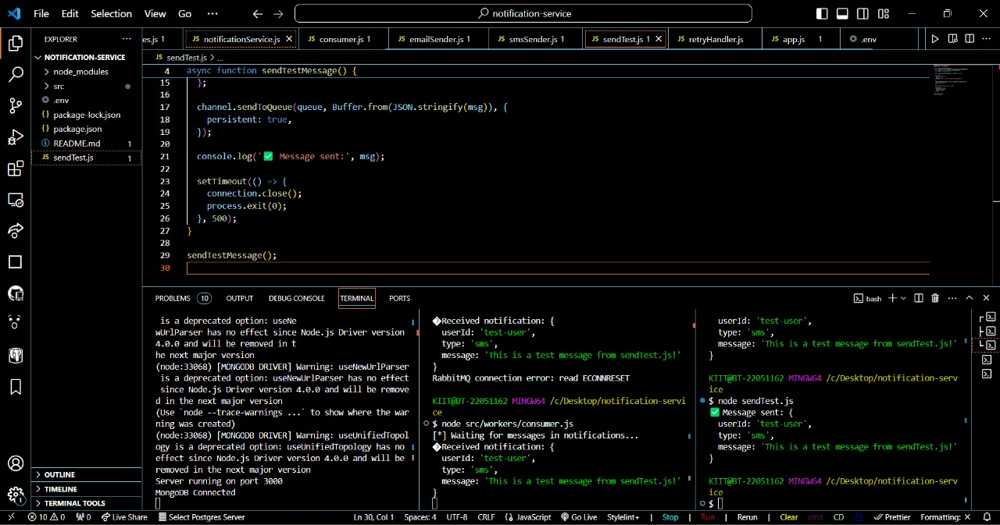
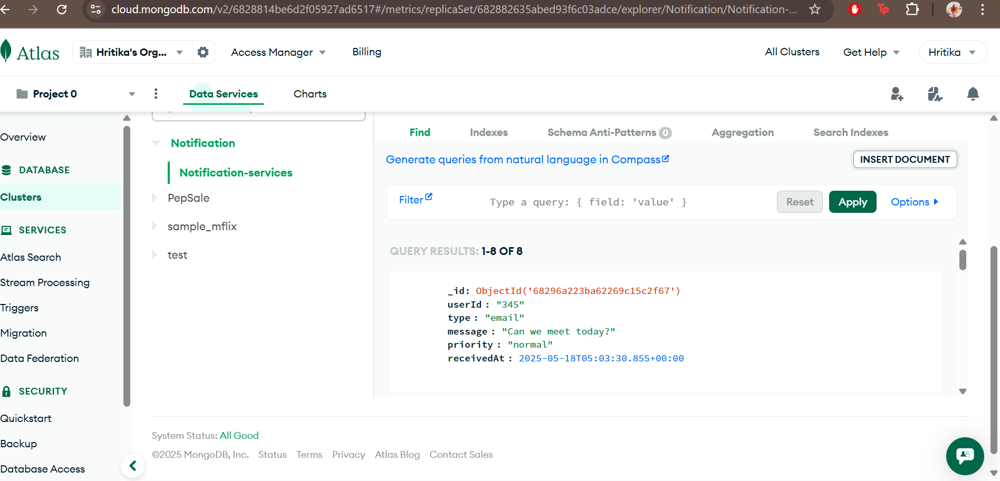

# 🚀 Notification Service

This project is a simple yet extensible notification service built with **Node.js**, **Express**, **MongoDB**, and **RabbitMQ (CloudAMQP)**.

---

## 📬 Features

- ✅ **Send notifications** via Email, SMS, or In-App
- ✅ **Queue-based processing** using RabbitMQ for performance and scalability
- ✅ **Priority queue** handling: `critical`, `normal`, `low`
- ✅ **Retry mechanism** for failed notifications
- ✅ **Rate limiter** to prevent API spamming
- ✅ **REST API** to send and fetch user notifications

---

## 📌 New Features Added

### 🔁 1. Retry Logic
- If a notification fails to send (e.g., due to network error), it will be retried a limited number of times before logging as a failed attempt.

### ⚠️ 2. Priority Queue
- Notifications are now prioritized:
  - `critical` → High priority (processed first)
  - `normal` → Default priority
  - `low` → Least urgent
- Implemented using RabbitMQ’s `x-max-priority` setting.

### 🛡️ 3. Rate Limiting
- API is protected by a rate limiter using `express-rate-limit`.
- Each IP is limited to **5 notification requests per minute**.
- Prevents spam or abuse.

---

## 📦 Technologies Used

- **Node.js**
- **Express.js**
- **MongoDB (via Mongoose)**
- **RabbitMQ (via CloudAMQP)**
- **amqplib**
- **express-rate-limit**
- **dotenv**

---


## 🎥 Demo Video

Watch the notification service in action processing prioritized notifications, retrying failed attempts, and delivering messages smoothly:

  

---

## 🖼️ Screenshots

### Notification Queue Consumer Processing


### Notification Sent Successfully (SMS)



### MongoDB Database Snapshot



---

## 🛠️ Setup Instructions

1. **Clone the repository:**
   ```bash
   git clone https://github.com/yourusername/notification-service.git
   cd notification-service
